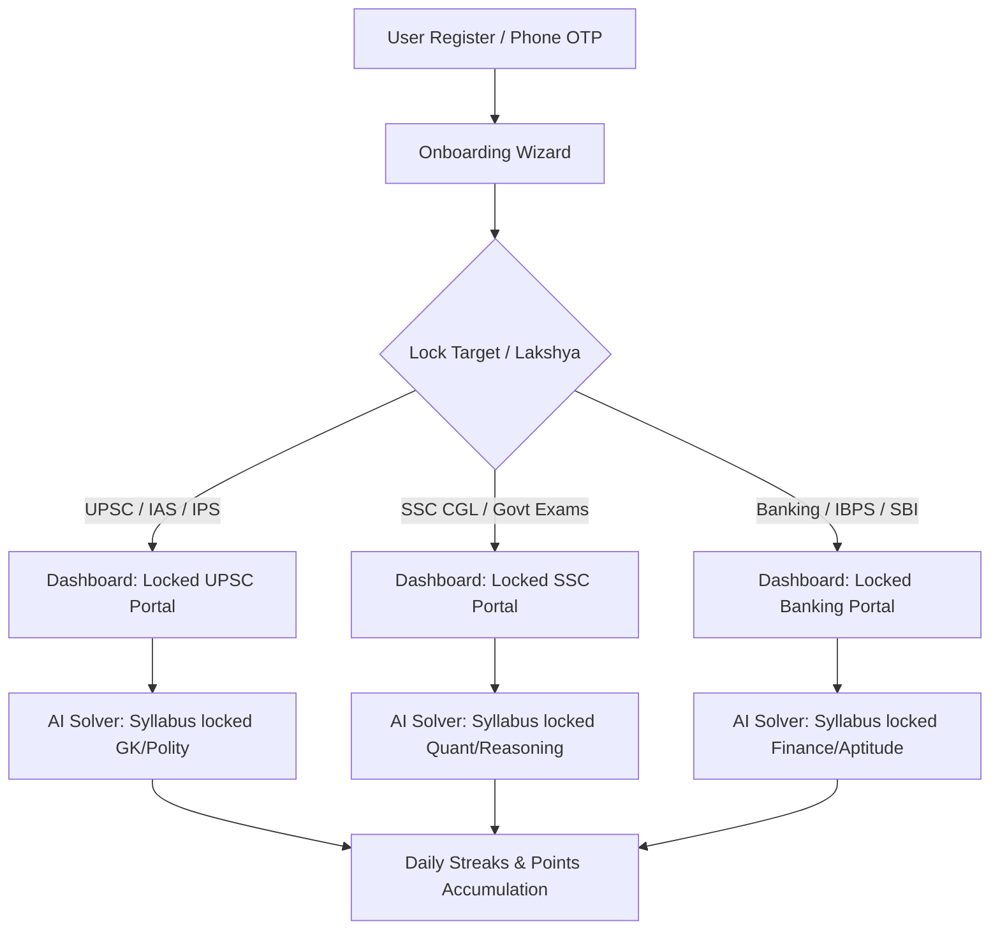
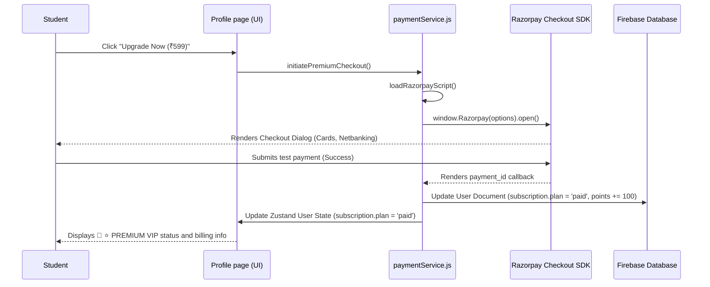

# Master Plan & Feature Ecosystem Document: PrepBridge 🚀

Welcome to the **PrepBridge Master Plan and Feature Specification**. This document serves as the absolute source of truth for the platform's vision, core modules, database architecture, payment flows, and technical guidelines for future developers and researchers.

---

## 🎯 Platform Vision & The "Lakshya" Ethos
PrepBridge is designed specifically for competitive exam aspirants across India (especially first-generation learners from tier-2/3 cities and rural backgrounds). The system is built around the concept of a locked **Lakshya** (Target Goal). 

Rather than overloading students with general study topics, the platform strictly immerses them in their target exam path from the moment they onboard, providing structured focus and daily motivation to move closer to their dreams every single day.



---

## 📦 Implemented Feature Ecosystem

| Feature Area | Description | Target Benefit | Tech Stack & States |
| :--- | :--- | :--- | :--- |
| **Primary Target Lock** | Aspirants select a single primary competitive exam in onboarding to lock their dashboard. | Immersive target-oriented focus, zero distractions. | Zustand `useUserStore` -> Firestore sync (`primaryTarget`). |
| **Slogan Tagline Custody** | Custom generated inspirational tagline reflecting their locked target, editable in profile. | Consistent mental reinforcement and goal clarity. | Zustand `useUserStore` -> Firestore sync (`lakshyaSlogan`). |
| **Mera Lakshya Vision Banner** | Glassmorphic dashboard header featuring locked target, custom slogan, and live exam countdown. | Drives urgency and focus down to the exact day. | client-side `date-fns` calculators inside `Dashboard.jsx`. |
| **Streaks & Leaderboards** | Rewarding daily study sessions, Mock tests, and Quizzes with **+10 points** and streak increments. | Gamified retention, driving daily app visits. | Zustand `useAppStore` -> Firestore sync (`streak`, `points`). |
| **Auto-Current Affairs** | Daily updated national/state news summaries dynamically highlighted by relevance to their target. | Replaces expensive newspapers, focusing only on PYQ value. | Auto-parsing inside `currentAffairsService.js`. |
| **Gemini AI Doubt Solver** | Multimodal OCR question scanner returning step-by-step guidance in chosen native language. | Demystifies complex textbook/test-series questions instantly. | Google Gemini 2.0 Flash (`inlineData` base64 + text parts). |
| **Native Language Bar** | Dropdown inside Doubt Solver header with Indian flag scripts (Hindi, Tamil, Telugu, Marathi, etc.). | Empowers rural aspirants who struggle with English terms. | Dynamic language parameter routing inside `gemini.js`. |
| **Razorpay Payments** | dynamic script loading of Razorpay Checkout for quick upgrades to VIP plan (₹599/yr). | Monitored, scalable revenue stream for premium content. | `paymentService.js` + client-side Netbanking test gateway. |
| **Daily AI Question Locker** | Free tier is capped at 5 questions/day. Locker card takes over input form upon reaching cap. | Drives premium conversion by highlighting visual AI value. | `pb_ai_count_` local storage locks + `Link` redirection. |

---

## 📸 Multimodal Gemini AI Doubt Solver 🤖
A core pillar of PrepBridge is the **Multimodal Gemini AI Doubt Solver**, powered directly by **Google Gemini 2.0 Flash**. It bridges textbook print with advanced artificial intelligence.

### Multimodal Payload Architecture
When a student scans or uploads a textbook question, the image file is converted on the client into a base64 string using `FileReader`. The prompt is structured in a multi-part payload:

1. **System Instruction**: Enforces the AI to behave as a professional competitive exam tutor, utilizing simple structures, **Exam Tips**, **Memory Tricks**, and **PYQ References**.
2. **Inline Data (Multimodal Part)**: Staged before the text prompt to provide visual parsing parameters:
   ```json
   {
     "inlineData": {
       "mimeType": "image/jpeg",
       "data": "/9j/4AAQSkZJRgABAQEASABIAAD..."
     }
   }
   ```
3. **Text Prompt (Context Part)**: Combines user query text, locked target exam context, and native language instructions:
   ```text
   [User Message]
   IMPORTANT: The user prefers responses in Hindi. Please respond in Hindi while keeping technical terms in English.
   The user is preparing for: UPSC. Tailor your response accordingly.
   ```

### 🔒 Subscription Locking Rules
- **Free Tier**: 5 queries per day. Daily count is tracked securely using local storage keys keyed by date (`pb_ai_count_YYYY-MM-DD`). Upon reaching the limit, the input form is locked and replaced with a high-converting Upgrade Banner.
- **Premium Tier (`paid`)**: Unlimited daily queries. Caches prior visual queries in conversation history recall buffers so Gemini retains memory of previously uploaded photos.

---

## 💳 Razorpay Payments Flow Integration
PrepBridge integrates **Razorpay Checkout** to monetize premium mock series and unlimited AI doubt solving.



---

## 📊 Administrator Panel Architecture
The Admin Panel allows staff to audit, monitor, and configure the platform's operations in real-time.

1. **Revenues Monitor**: Dynamically counts total paid users in Firestore and displays total platform revenue instantly (Paid Users × ₹599).
2. **Targets Distribution**: Aggregates locked target configurations from Firestore user profiles, transforming them into responsive Recharts visualization widgets.
3. **VIP Access override**: Stages a "VIP Shield Toggle" button inside the student directory grid. Clicking it immediately grants or revokes Premium status for any user directly from the admin portal, syncing back to Firestore and local stores.
4. **Offline Resilience**: Built-in mock data triggers fallback immediately if Firebase services are blocked or offline, maintaining UI stability during demo presentations.

---

## 🛠️ Onboarding Developer Checklist
When configuring a new development workstation or deploying updates, follow this sequence:

1. **Install Dependencies**:
   ```bash
   npm install
   ```
2. **Local Development Server**:
   ```bash
   npm run dev
   ```
3. **Verify Firebase Credentials**: Ensure `src/firebase/config.js` points to the active Firebase project and Google Auth is enabled under Authentication.
4. **Vite Production Bundler**:
   ```bash
   npm run build
   ```
   - Verify that PWA assets precache all index bundles (`dist/sw.js` and `dist/workbox-xxx.js` generated).
